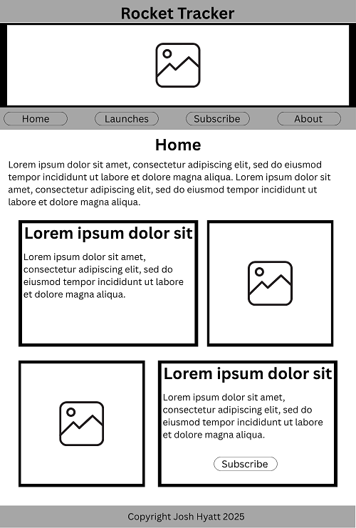
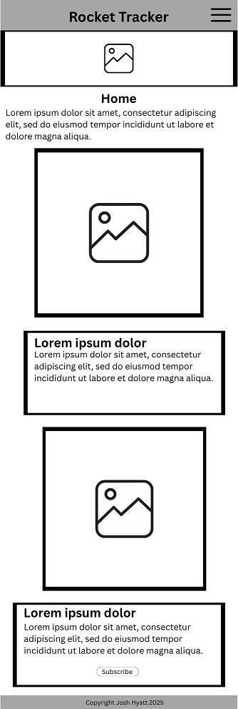

# Final Project Proposal

## Site Name

To avoid clashing with a similar site, the website will be called **Rocket Tracker**.

## Site Purpose

The purpose of the site will be to teach visitors about orbital launches and space travel, as well as to provide a platform for users to track upcoming launches and learn about the companies and technologies involved. It hooks into the Launch Library 2 API to provide real-time data on launches, including dates, times, and details about the rockets and payloads.

## Scenarios

- When is the next launch I'll be able to see from my location?
- How can I get notified about upcoming launches?
- What on earth *is* everyone putting into space anyway?

## Color Schema

```css
:root {
    --primary-color: #1E2A38;
    --secondary-color: #7C8EA1;
    --accent1-color: #C46009;
    --accent2-color: #FACE3C;
    --text-color: #2D2D2D;
}
```

## Typography

Headers will use the "Orbitron" font, which is a futuristic typeface suitable for space themes. Body text will use "Open Sans", a clean and readable font.

## Wireframes

### Home Page



### Home Page (Mobile)


